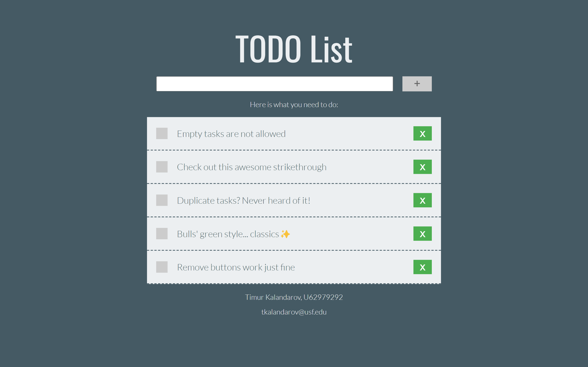

# Simple To-Do List 
Take-home project given by [USF Honors IT](https://github.com/USF-Honors-College) as a part of hiring process.
 
 
Check out [Live Demo](https://codesandbox.io/s/github/tkalandarov/ToDoList)

<i>Date Created: <b>July 2020<b/><i/>
